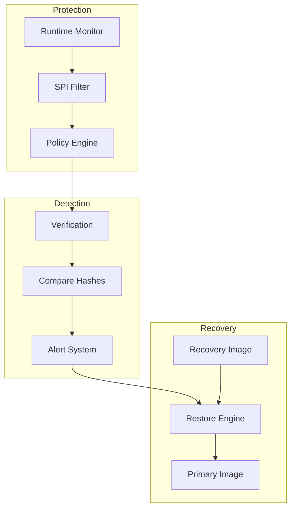
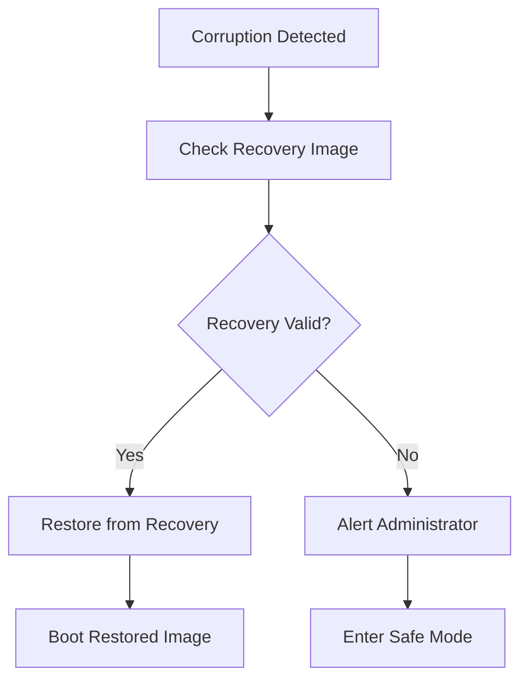

# Platform Firmware Resilience (PFR)

PFR ensures firmware integrity and provides recovery from corruption or attacks, following NIST SP 800-193 guidelines.

## PFR Architecture



## NIST SP 800-193 Requirements

| Principle | Description | Implementation |
|-----------|-------------|----------------|
| Protection | Prevent unauthorized modification | SPI filtering, write protect |
| Detection | Identify unauthorized changes | Hash verification, runtime checks |
| Recovery | Restore to known-good state | Dual images, recovery mode |

## SPI Flash Protection

### SPI Filter

```c
/* SPI filter configuration */
struct spi_filter_rule {
    uint32_t start_addr;
    uint32_t end_addr;
    uint8_t allowed_cmds;
    bool read_only;
};

#define SPI_CMD_READ    0x03
#define SPI_CMD_WRITE   0x02
#define SPI_CMD_ERASE   0x20

static const struct spi_filter_rule host_flash_rules[] = {
    /* BIOS region - protected */
    { 0x00000000, 0x00FFFFFF, SPI_CMD_READ, true },
    /* BMC region - protected */
    { 0x01000000, 0x01FFFFFF, SPI_CMD_READ, true },
    /* Data region - read/write allowed */
    { 0x02000000, 0x02FFFFFF, SPI_CMD_READ | SPI_CMD_WRITE, false },
};

void spi_filter_init(void)
{
    for (int i = 0; i < ARRAY_SIZE(host_flash_rules); i++) {
        const struct spi_filter_rule *r = &host_flash_rules[i];
        spi_filter_set_region(i, r->start_addr, r->end_addr,
                              r->allowed_cmds, r->read_only);
    }

    spi_filter_enable();
}

/* Filter callback on SPI transaction */
bool spi_filter_check(uint8_t cmd, uint32_t addr, size_t len)
{
    for (int i = 0; i < ARRAY_SIZE(host_flash_rules); i++) {
        const struct spi_filter_rule *r = &host_flash_rules[i];

        if (addr >= r->start_addr && addr < r->end_addr) {
            if (r->read_only && (cmd != SPI_CMD_READ)) {
                LOG_WRN("Blocked write to protected region: 0x%08x", addr);
                log_security_event(EVT_WRITE_BLOCKED, addr, cmd);
                return false;
            }
            return true;
        }
    }

    /* Default deny */
    return false;
}
```

## Firmware Verification

### Manifest Structure

```c
/* PFR manifest */
struct pfr_manifest {
    uint32_t magic;           /* "PFRM" */
    uint32_t version;
    uint32_t flags;

    /* Image regions */
    struct {
        uint32_t offset;
        uint32_t size;
        uint8_t hash[32];
    } regions[8];
    uint8_t region_count;

    /* Signature */
    uint8_t signature[64];
    uint8_t key_id;
};

#define PFR_MAGIC 0x4D524650  /* "PFRM" */
```

### Verification Process

```c
int pfr_verify_firmware(const struct pfr_manifest *manifest,
                        const uint8_t *firmware)
{
    int ret;

    /* 1. Verify manifest signature */
    ret = verify_manifest_signature(manifest);
    if (ret != 0) {
        LOG_ERR("Manifest signature invalid");
        return PFR_ERR_SIGNATURE;
    }

    /* 2. Verify each region */
    for (int i = 0; i < manifest->region_count; i++) {
        uint8_t computed_hash[32];
        const uint8_t *region = firmware + manifest->regions[i].offset;

        compute_sha256(region, manifest->regions[i].size, computed_hash);

        if (memcmp(computed_hash, manifest->regions[i].hash, 32) != 0) {
            LOG_ERR("Region %d hash mismatch", i);
            return PFR_ERR_HASH;
        }
    }

    LOG_INF("Firmware verification passed");
    return PFR_OK;
}
```

## Runtime Monitoring

```c
/* Periodic verification */
#define VERIFY_INTERVAL_MS 60000

void runtime_monitor_thread(void)
{
    while (1) {
        /* Verify BMC firmware */
        if (pfr_verify_active_image(TARGET_BMC) != PFR_OK) {
            LOG_ERR("BMC firmware corruption detected");
            initiate_recovery(TARGET_BMC);
        }

        /* Verify host BIOS */
        if (pfr_verify_active_image(TARGET_HOST) != PFR_OK) {
            LOG_ERR("Host firmware corruption detected");
            initiate_recovery(TARGET_HOST);
        }

        /* Check for unauthorized changes */
        check_flash_modifications();

        k_sleep(K_MSEC(VERIFY_INTERVAL_MS));
    }
}

void check_flash_modifications(void)
{
    static uint8_t last_hash[32];
    uint8_t current_hash[32];

    compute_flash_hash(BIOS_START, BIOS_SIZE, current_hash);

    if (memcmp(current_hash, last_hash, 32) != 0) {
        LOG_WRN("Flash content changed");
        log_security_event(EVT_FLASH_MODIFIED, 0, 0);
    }

    memcpy(last_hash, current_hash, 32);
}
```

## Recovery Process

### Recovery Flow



### Recovery Implementation

```c
/* Recovery targets */
enum recovery_target {
    TARGET_BMC,
    TARGET_HOST,
    TARGET_ROT,
};

/* Recovery sources */
enum recovery_source {
    SOURCE_BACKUP_FLASH,
    SOURCE_GOLDEN_IMAGE,
    SOURCE_NETWORK,
};

int initiate_recovery(enum recovery_target target)
{
    int ret;

    LOG_WRN("Initiating recovery for target %d", target);
    log_security_event(EVT_RECOVERY_START, target, 0);

    /* Try backup flash first */
    ret = recover_from_source(target, SOURCE_BACKUP_FLASH);
    if (ret == PFR_OK) {
        return PFR_OK;
    }

    /* Fall back to golden image */
    ret = recover_from_source(target, SOURCE_GOLDEN_IMAGE);
    if (ret == PFR_OK) {
        return PFR_OK;
    }

    /* Last resort: network recovery */
    ret = recover_from_source(target, SOURCE_NETWORK);

    return ret;
}

int recover_from_source(enum recovery_target target,
                        enum recovery_source source)
{
    uint32_t src_addr, dst_addr;
    size_t size;

    /* Get addresses based on target and source */
    get_recovery_addresses(target, source, &src_addr, &dst_addr, &size);

    /* Verify recovery image */
    const struct pfr_manifest *manifest = get_manifest(src_addr);
    if (pfr_verify_firmware(manifest, (const uint8_t *)src_addr) != PFR_OK) {
        LOG_ERR("Recovery image invalid");
        return PFR_ERR_INVALID_IMAGE;
    }

    /* Copy recovery image to active region */
    LOG_INF("Copying recovery image from 0x%08x to 0x%08x (%zu bytes)",
            src_addr, dst_addr, size);

    flash_erase(dst_addr, size);
    flash_copy(dst_addr, src_addr, size);

    /* Verify copy */
    if (pfr_verify_firmware(manifest, (const uint8_t *)dst_addr) != PFR_OK) {
        LOG_ERR("Recovery copy verification failed");
        return PFR_ERR_COPY_FAILED;
    }

    LOG_INF("Recovery complete");
    log_security_event(EVT_RECOVERY_COMPLETE, target, source);

    return PFR_OK;
}
```

## Security Event Logging

```c
/* Security events */
enum security_event {
    EVT_BOOT_VERIFY_PASS,
    EVT_BOOT_VERIFY_FAIL,
    EVT_WRITE_BLOCKED,
    EVT_FLASH_MODIFIED,
    EVT_RECOVERY_START,
    EVT_RECOVERY_COMPLETE,
    EVT_ATTACK_DETECTED,
};

struct security_log_entry {
    uint32_t timestamp;
    uint16_t event;
    uint16_t severity;
    uint32_t param1;
    uint32_t param2;
};

#define MAX_LOG_ENTRIES 256
static struct security_log_entry security_log[MAX_LOG_ENTRIES];
static uint16_t log_index;

void log_security_event(enum security_event event,
                        uint32_t param1, uint32_t param2)
{
    struct security_log_entry *entry = &security_log[log_index];

    entry->timestamp = k_uptime_get_32();
    entry->event = event;
    entry->severity = get_event_severity(event);
    entry->param1 = param1;
    entry->param2 = param2;

    log_index = (log_index + 1) % MAX_LOG_ENTRIES;

    /* Persist to flash periodically */
    if ((log_index % 16) == 0) {
        persist_security_log();
    }
}
```

## Best Practices

1. **Defense in depth** - Multiple protection layers
2. **Secure recovery images** - Verify before restore
3. **Audit everything** - Log all security events
4. **Fail secure** - Enter safe mode if recovery fails
5. **Regular verification** - Don't just verify at boot

## Next Steps

Learn about [Security Lessons]() from the ASPEED RoT implementation.
