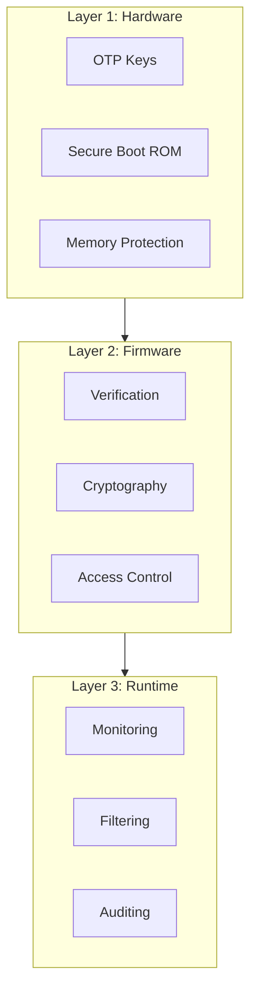

# Security Lessons from ASPEED RoT

Key security patterns and best practices learned from Root of Trust development.

## Security Architecture Principles

### Defense in Depth



### Least Privilege

```c
/* Restrict access based on role */
enum security_role {
    ROLE_BOOT,      /* Boot-time only operations */
    ROLE_RUNTIME,   /* Normal runtime operations */
    ROLE_ADMIN,     /* Administrative operations */
};

struct api_permission {
    enum security_role min_role;
    bool (*check)(void);
};

static const struct api_permission api_perms[] = {
    [API_READ_SENSOR] = { ROLE_RUNTIME, NULL },
    [API_WRITE_CONFIG] = { ROLE_ADMIN, check_admin_auth },
    [API_UPDATE_FW] = { ROLE_ADMIN, check_update_auth },
    [API_READ_KEYS] = { ROLE_BOOT, check_boot_phase },
};

int check_permission(enum api_id api)
{
    if (current_role < api_perms[api].min_role) {
        return -EPERM;
    }

    if (api_perms[api].check && !api_perms[api].check()) {
        return -EACCES;
    }

    return 0;
}
```

## Cryptographic Best Practices

### Key Hierarchy

```c
/* Key hierarchy */
struct key_hierarchy {
    /* Level 0: Root (OTP, immutable) */
    uint8_t root_key[32];

    /* Level 1: Platform (derived, persistent) */
    uint8_t platform_key[32];

    /* Level 2: Session (derived, ephemeral) */
    uint8_t session_key[32];
};

int derive_platform_key(const uint8_t *root, uint8_t *platform)
{
    /* Use HKDF to derive platform key */
    uint8_t info[] = "Platform Key v1";
    return hkdf_sha256(root, 32, NULL, 0, info, sizeof(info),
                       platform, 32);
}
```

### Secure Key Storage

```c
/* Never expose keys in memory longer than needed */
int sign_with_key(const uint8_t *data, size_t len,
                  uint8_t *signature, uint8_t key_slot)
{
    uint8_t key[32];
    int ret;

    /* Load key into temporary buffer */
    ret = secure_key_load(key_slot, key, sizeof(key));
    if (ret != 0) {
        return ret;
    }

    /* Sign the data */
    ret = crypto_sign(key, sizeof(key), data, len, signature);

    /* Clear key from memory immediately */
    explicit_bzero(key, sizeof(key));

    return ret;
}
```

### Constant-Time Operations

```c
/* Constant-time comparison to prevent timing attacks */
int secure_compare(const uint8_t *a, const uint8_t *b, size_t len)
{
    volatile uint8_t result = 0;

    for (size_t i = 0; i < len; i++) {
        result |= a[i] ^ b[i];
    }

    return result == 0 ? 0 : -1;
}

/* Avoid early exits in security-critical code */
int verify_password(const char *input, const char *stored)
{
    uint8_t input_hash[32];
    uint8_t stored_hash[32];

    /* Always hash both, even if lengths differ */
    hash_password(input, input_hash);
    hash_password(stored, stored_hash);

    /* Constant-time comparison */
    return secure_compare(input_hash, stored_hash, 32);
}
```

## Error Handling

### Fail Secure

```c
/* Default to secure state on errors */
int boot_verify(void)
{
    int ret;

    ret = verify_stage1();
    if (ret != 0) {
        /* Don't continue on error */
        enter_recovery_mode(REASON_VERIFY_FAIL);
        /* Never returns */
    }

    ret = verify_stage2();
    if (ret != 0) {
        enter_recovery_mode(REASON_VERIFY_FAIL);
    }

    /* Only reach here if all verifications pass */
    return 0;
}

void enter_recovery_mode(int reason)
{
    LOG_ERR("Entering recovery mode: %d", reason);

    /* Disable normal boot path */
    disable_boot_flash();

    /* Enable recovery interface */
    enable_recovery_uart();

    /* Wait for recovery command */
    while (1) {
        handle_recovery_command();
    }
}
```

### Audit Trail

```c
/* Log all security-relevant operations */
#define AUDIT_LOG(level, fmt, ...) \
    do { \
        audit_entry_add(level, __func__, __LINE__, fmt, ##__VA_ARGS__); \
    } while (0)

int firmware_update(const uint8_t *image, size_t len)
{
    AUDIT_LOG(AUDIT_INFO, "Firmware update started, size=%zu", len);

    int ret = verify_update_signature(image, len);
    if (ret != 0) {
        AUDIT_LOG(AUDIT_WARN, "Update signature invalid");
        return ret;
    }

    AUDIT_LOG(AUDIT_INFO, "Update signature valid");

    ret = apply_update(image, len);
    if (ret != 0) {
        AUDIT_LOG(AUDIT_ERROR, "Update apply failed: %d", ret);
        return ret;
    }

    AUDIT_LOG(AUDIT_INFO, "Firmware update complete");
    return 0;
}
```

## Memory Safety

### Buffer Bounds Checking

```c
/* Always validate buffer sizes */
int copy_to_user(void *dest, size_t dest_size,
                 const void *src, size_t src_size)
{
    if (dest == NULL || src == NULL) {
        return -EINVAL;
    }

    if (src_size > dest_size) {
        LOG_ERR("Buffer overflow prevented: %zu > %zu",
                src_size, dest_size);
        return -EOVERFLOW;
    }

    memcpy(dest, src, src_size);
    return 0;
}
```

### Stack Canaries

```kconfig
# Enable in Kconfig
CONFIG_STACK_CANARIES=y
CONFIG_STACK_SENTINEL=y
CONFIG_HW_STACK_PROTECTION=y
```

### Memory Wiping

```c
/* Clear sensitive data when done */
void process_secret(const uint8_t *secret, size_t len)
{
    uint8_t local_copy[256];

    if (len > sizeof(local_copy)) {
        return;
    }

    memcpy(local_copy, secret, len);

    /* Process the secret */
    do_sensitive_operation(local_copy, len);

    /* Wipe before returning */
    explicit_bzero(local_copy, sizeof(local_copy));
}
```

## Input Validation

```c
/* Validate all external input */
int handle_command(const uint8_t *cmd, size_t len)
{
    /* Check minimum length */
    if (len < MIN_CMD_LEN) {
        return -EINVAL;
    }

    /* Check maximum length */
    if (len > MAX_CMD_LEN) {
        return -EINVAL;
    }

    /* Validate command code */
    uint8_t code = cmd[0];
    if (code >= NUM_COMMANDS) {
        return -EINVAL;
    }

    /* Validate payload length */
    uint16_t payload_len = (cmd[1] << 8) | cmd[2];
    if (payload_len != len - HEADER_SIZE) {
        return -EINVAL;
    }

    /* Now safe to process */
    return process_command(code, cmd + HEADER_SIZE, payload_len);
}
```

## Security Testing

### Fuzzing

```c
/* Build fuzzing targets */
#ifdef CONFIG_FUZZING

int LLVMFuzzerTestOneInput(const uint8_t *data, size_t size)
{
    /* Test parser with random input */
    parse_message(data, size);
    return 0;
}

#endif
```

### Security Unit Tests

```c
ZTEST(security, test_buffer_overflow_prevention)
{
    uint8_t dest[10];
    uint8_t src[20];

    int ret = copy_to_user(dest, sizeof(dest), src, sizeof(src));

    /* Should fail, not overflow */
    zassert_equal(ret, -EOVERFLOW, "Overflow not detected");
}

ZTEST(security, test_constant_time_compare)
{
    uint8_t a[] = { 0x01, 0x02, 0x03 };
    uint8_t b[] = { 0x01, 0x02, 0x04 };

    /* Should fail but take same time */
    int64_t start = k_uptime_ticks();
    int result = secure_compare(a, b, sizeof(a));
    int64_t elapsed = k_uptime_ticks() - start;

    zassert_not_equal(result, 0, "Should not match");
    /* Timing should be consistent (hard to test precisely) */
}
```

## Summary: Security Checklist

| Category | Requirement |
|----------|-------------|
| **Keys** | Store in OTP/secure storage, never expose |
| **Crypto** | Use constant-time operations, proper algorithms |
| **Memory** | Validate bounds, wipe secrets, use stack protection |
| **Input** | Validate all external data |
| **Errors** | Fail secure, don't leak information |
| **Audit** | Log all security events |
| **Testing** | Fuzz inputs, test edge cases |

## Conclusion

Building secure systems requires:

1. **Architecture** - Design security in from the start
2. **Defense in depth** - Multiple layers of protection
3. **Fail secure** - Default to safe state
4. **Audit trail** - Know what happened
5. **Testing** - Verify security properties

These patterns from ASPEED RoT apply to any security-sensitive Zephyr application.

## Additional Resources

- [NIST SP 800-193](https://csrc.nist.gov/publications/detail/sp/800-193/final) - Platform Firmware Resiliency
- [TCG DICE](https://trustedcomputinggroup.org/work-groups/dice-architectures/) - Device Identity
- [DMTF SPDM](https://www.dmtf.org/standards/spdm) - Security Protocol

## Next Steps

Review the complete [Zephyr Guide Tutorial]() or explore specific topics in earlier parts.
