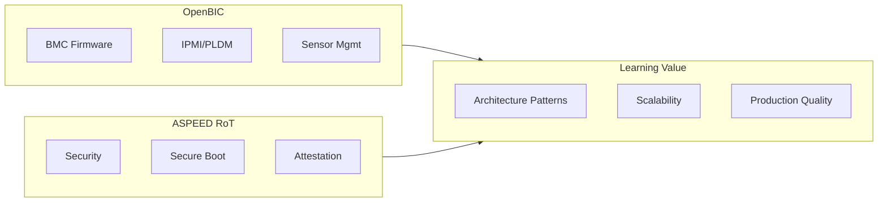

# Part 7: Professional Case Studies

This section analyzes real-world Zephyr projects to demonstrate professional-level patterns and architectures.

## What You'll Learn

- OpenBIC: Open-source BMC firmware architecture
- ASPEED RoT: Security-focused Zephyr implementation
- Design patterns from production systems
- Best practices for large-scale Zephyr projects

## Case Studies

### OpenBIC - BMC Firmware

| Chapter | Description |
|---------|-------------|
| [OpenBIC Overview]() | Introduction and architecture |
| [Architecture]() | Module organization |
| [Protocols]() | IPMI/PLDM implementation |
| [Sensors]() | Sensor framework |
| [Lessons]() | Design patterns |

### ASPEED RoT - Root of Trust

| Chapter | Description |
|---------|-------------|
| [RoT Overview]() | Security architecture |
| [Secure Boot]() | Boot verification |
| [Attestation]() | DICE/SPDM |
| [PFR]() | Platform Firmware Resilience |
| [Lessons]() | Security patterns |

## Why Study These Projects?

{: .important }
These case studies demonstrate how Zephyr is used in demanding production environments.
